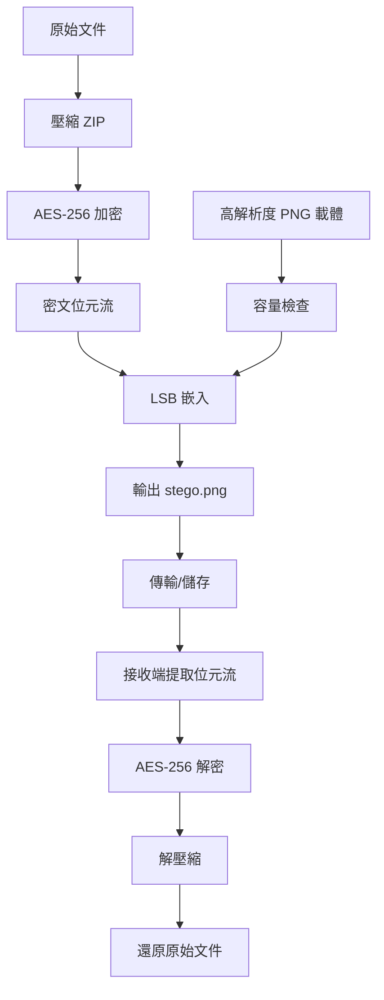

# 檔案加密隱寫系統（AES-256-CBC + HMAC + LSB）

這個專案實作你要求的核心流程：
1. 壓縮原始文件（ZIP）
2. AES-256 加密（AES-256-CBC + HMAC-SHA256 + PBKDF2）
3. 將密文用 LSB 嵌入 PNG 圖片
4. 從圖片提取後解密並還原文件

## 核心安全流程



## 安裝

```bash
python3 -m venv .venv
source .venv/bin/activate
pip install -r requirements.txt
```

## 使用方式

### 桌面 GUI（Tkinter）

啟動：

```bash
python3 steg_gui.py
```

GUI 功能：
- 若輸出 stego.png 重名，會自動改為 stego_1.png、stego_2.png... 避免覆蓋。
- `隱藏（Hide）`：選擇要隱藏的檔案/資料夾、載體 PNG、輸出 PNG、密碼後執行。
- `還原（Reveal）`：選擇隱寫 PNG、輸出資料夾、密碼，可勾選自動解壓。

### macOS 打包輸出

專案已提供：
- `檔案加密隱寫系統.app`
- `檔案加密隱寫系統-macOS.zip`

說明：
- 此 `.app` 仍需目標機器有 `python3` 與 `Pillow`（`pip install Pillow`）。

### Windows 打包（.exe）

本機是 macOS，無法直接交叉編譯 Windows `.exe`。已提供 GitHub Actions 自動打包流程：
- workflow: `.github/workflows/build-windows.yml`
- 產出：`StegSecureWin.zip`（內含 `StegSecureWin.exe`）

使用方式：
1. 專案 push 到 GitHub（建議分支 `main`）。
2. 到 GitHub `Actions` 執行 `Build Windows App`（或 push 到 `main` 自動觸發）。
3. 在該次 workflow 的 `Artifacts` 下載 `StegSecureWin`。

### 1) 隱藏文件到圖片

```bash
python3 steg_secure.py hide \
  --input ./secret_folder \
  --cover ./cover.png \
  --output ./stego.png \
  --password '你的強密碼'
```

### 2) 從圖片還原文件

```bash
python3 steg_secure.py reveal \
  --input ./stego.png \
  --output-dir ./recovered \
  --password '你的強密碼' \
  --unpack
```

輸出結果：
- `recovered/recovered_payload.zip`
- `recovered/recovered_files/`（使用 `--unpack` 時）

## 安全說明

- 若攻擊者只拿到 stego 圖片，最多提取出密文，沒有密碼仍無法解密。
- 加密採用 AES-256-CBC（機密性）+ HMAC-SHA256（完整性驗證），密鑰由 PBKDF2 派生（含 salt）。
- 載體圖片建議使用高解析度、色彩豐富的 PNG，避免純色圖。
- LSB 嵌入與提取改為 generator 串流與 `img.load()` 逐像素處理，不再將整個 payload 一次載入記憶體。

## 注意事項

- 只支援 PNG 作為嵌入輸出格式。
- 請使用強密碼，避免重複使用舊密碼。
- 圖片容量不足時，程式會自動等比例放大載體 PNG 後再嵌入，因此輸出圖尺寸可能比原圖大。
